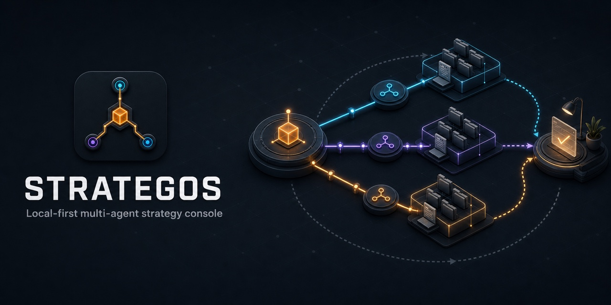
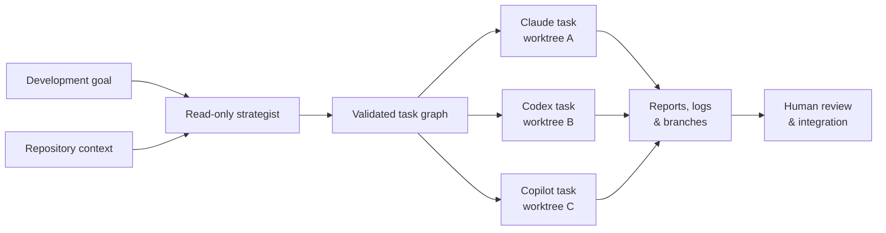

# Strategos

**A local-first strategist for Claude Code, Codex CLI, and GitHub Copilot CLI.**

Strategos turns one development goal into an explicit task graph, dispatches
ready tasks to existing agent CLIs in parallel, and gives every task its own Git
worktree. Context, dependency reports, logs, branches, and changed-file lists
remain inspectable on your machine.

> Early MVP. Strategos intentionally does not auto-merge or auto-push agent
> branches.

[简体中文](README.zh-CN.md)

<p align="center">
  
</p>

<p align="center"><em>One goal → validated plan → parallel worktrees → human review.</em></p>

## Why

Running three coding agents in three terminals is easy. Keeping them aligned is
not. Their native conversations are incompatible, concurrent edits collide,
and useful decisions disappear into session history.

Strategos provides a small neutral layer:

- **Shared context** compiled from `AGENTS.md`, project context, team memory,
  task-specific files, and completed dependency reports.
- **CLI-generated task graph** produced by one read-only strategist CLI, then
  schema-checked and shown before worker execution.
- **Hybrid participation by default** so the strategist joins the healthy
  worker pool after planning; strict role separation remains configurable.
- **Automatic execution by default**: each generated plan is previewed and then
  run immediately; `/mode manual` restores an explicit execution gate.
- **Durable recovery context**: goals, plans, progress, and failures are
  checkpointed locally so `/resume` can give a strategist the prior context.
- **Interrupt and resume**: the Web inspector can stop active strategist and
  worker CLI process groups without discarding the durable Session context.
- **Image context**: `/attach <path>` sends PNG, JPEG, GIF, or WebP evidence to
  the strategist and copies it into every isolated worker worktree.
- **Single-CLI multi-session mode**: one healthy agent CLI is enough. Strategos
  starts independent provider sessions/processes with distinct worktrees and
  reports, and still runs safe tasks in parallel.
- **Parallel waves** capped by a configurable concurrency limit.
- **Worktree isolation** for every task, including independent branches.
- **Provider adapters** for `claude`, `codex`, and `copilot` commands already
  authenticated on the host.
- **Durable evidence** under `.strategos/runs/<run-id>/`.
- **Defensive completion checks**: exit code zero without a report is treated as
  failure because some older agent CLIs return success after provider errors.
- **Human-controlled integration**: review and merge the branches you want.
- **Local Web UI**: a Vite+ interface for chat, saved sessions, run evidence,
  orchestration settings, and image attachments.

## How it works



Ready tasks run in parallel; dependent tasks wait for upstream reports. Every
worker stays isolated in its own branch and worktree until you decide what to
integrate.

## Quick start

Requirements: Node.js 24+, Git, and at least one supported agent CLI. If you
use `fnm`, run `fnm use` in the repository to select the pinned major version.

### Tested CLI baseline

| CLI | Tested version |
| --- | ---: |
| Claude Code | `2.1.215` |
| OpenAI Codex CLI | `0.144.6` |
| GitHub Copilot CLI | `1.0.71` |

These versions are the current validation baseline, not hard pins. See
[COMPATIBILITY.md](COMPATIBILITY.md) for the support and upgrade policy.

### Start the interactive console

The recommended human workflow is to launch Strategos inside a Git repository
and enter a development goal:

```bash
cd /path/to/your/repository
strategos
```

```text
STRATEGOS v0.13.0
Multi-agent strategy console · codex plans
~/path/to/your/repository

Agents   ● claude  ·  ● codex  ·  ● copilot
Runtime  Node v24.18.0 · Git 2.55.0

What are we building?
Describe a goal. Strategos previews the plan, then runs it automatically.

────────────────────────────────────────────────────────
/help commands  ·  /mode auto  ·  preview → run
❯ Add CSV export and focused tests

Planning  codex is reading the repository in read-only mode...
Plan ready  proposed by codex
Flow  1 implementation  →  2 review
Auto mode  Previewing before execution...
Preview  Max parallel: 3
Executing  Starting the current plan...
```

Ordinary text immediately asks the configured strategist CLI to inspect the
repository in read-only mode and return a JSON task graph. In the default
`hybrid` mode, every healthy agent CLI—including the strategist—may receive
worker tasks after planning. Strategos uses no model SDK, API key, or embedded
AI provider. The default `auto` execution mode validates and previews the plan,
then immediately starts its worker tasks. Use `/mode manual` before entering a
goal when you want the console to stop for review and wait for `/run`. Press
`Ctrl+C` once during planning to show an interruption warning, then press it
again within three seconds to cancel the strategist call. Press it while idle
to exit the console. Interrupted or failed work remains in a local session
journal. The next launch offers `/resume`. In an interactive terminal, it opens
a Claude Code-style picker: use the arrow keys to review session titles and
descriptions, then press Enter to continue or Esc to return. The strategist
receives the selected session's saved goal, plan, task progress, and error and
inspects the current repository before producing only the remaining work.
`/resume <id>` remains available for scripts and direct selection. Useful
console commands include:

```text
/new [goal]   /mode [auto|manual]  /strategist [agent]  /plan
/attach [path]  /attachments  /detach <id|all>  /load <file>
/save [file]  /preview               /run        /status [id]
/sessions     /resume [id]           /agents     /reload
/context      /init                  /help        /exit
```

See [docs/interactive-console.md](docs/interactive-console.md) for the complete
workflow and current boundaries.

### Start the local Web UI

The packaged Web UI uses the same local configuration, session journal,
planner, worktree runner, and authenticated agent CLIs as the terminal console:

```bash
cd /path/to/your/repository
strategos web
```

From an active Strategos console, the equivalent shortcut is:

```text
/web
```

Use `/web 4311` to choose another local port. Keep the console open while the
browser is using the embedded server; `/exit` stops it cleanly.

Open `http://127.0.0.1:4310`. The server binds to localhost by default. Use
`--host` and `--port` only when you intentionally need a different interface.
The production page does not include seeded demo data; it reads the current
repository and its locally persisted Strategos sessions directly.

Use the Projects section in the left sidebar to add or switch local Git
repositories. Projects and Sessions share the same navigation hierarchy, while
the product header shows compact active-project context. Saved work is opened
directly from the project-grouped Sessions list; there is no separate Runs view.
The selected path scopes configuration, sessions, attachments, AI repository context, planning,
and worker execution. Registered paths are stored locally in
`~/.strategos/projects.json`.

Settings controls the default execution mode, strategist CLI, and optional
desktop notifications for successful or failed tasks. Browser permission is
requested when notifications are enabled, and the Web UI must remain open for
delivery. Agent
availability comes from local health checks and each agent's `enabled` setting;
provider quota and billing remain in the provider's own CLI or dashboard. Auto
mode previews and runs the generated plan, while
Manual mode stops after planning and exposes a Run action. Session history,
image upload, Resume, recent events, and changed files remain local.

See [docs/web-ui.md](docs/web-ui.md) for Vite+ development commands and the
Web execution settings.

### Add image context

Attach a saved image before entering the goal:

```text
/attach ./screenshots/checkout-error.png
❯ Rebuild this state and fix the validation flow
```

On macOS, copy an image and run `/attach` without a path after installing the
optional clipboard helper with `brew install pngpaste`. `/attachments` lists
the current image context and `/detach <id>` removes one. Terminal emulators
such as Warp do not expose a pasted bitmap to child CLI processes, so raw
Command+V is not intercepted; use `/attach <path>` or clipboard capture.

Attachments are content-validated, capped at 20 MB, stored under the ignored
`.strategos/attachments/` directory, persisted in the durable session journal,
and restored by `/resume`. Codex receives native `--image` arguments, Copilot
receives native `--attachment` arguments, and Claude reads the copied local
paths from its task prompt.

### Run with only one agent CLI

When only one of Claude Code, Codex CLI, or Copilot CLI is healthy, the default
`hybrid` worker mode automatically uses single-CLI multi-session orchestration. The
strategist may create independent tasks for that same CLI; each task launches
as a new process/session with a unique session ID, Git worktree, branch, prompt,
and report. Independent tasks still respect `maxParallel`. Strategos does not
share native vendor transcripts between those workers; dependency reports and
the provider-neutral journal carry the shared context.

Interactive terminals receive the compact colored interface shown above.
Redirected output and CI remain free of ANSI control sequences. Set `NO_COLOR=1`
to disable color explicitly; `/agents` shows the full version and health detail.

### Run directly with `npx`

The fastest first run requires no clone or global installation:

```bash
cd /path/to/your/repository
npx --yes github:BigBugaboo/strategos
```

Non-interactive commands remain available when needed:

```bash
npx --yes github:BigBugaboo/strategos init
npx --yes github:BigBugaboo/strategos doctor
npx --yes github:BigBugaboo/strategos run .strategos/example-plan.json --dry-run
```

Until Strategos has a published npm release, `npx` installs the package from
the GitHub default branch and reuses the npm cache on later runs.

### Install persistently from GitHub

Install a reusable `strategos` command without manually cloning the repository:

```bash
npm install --global github:BigBugaboo/strategos
strategos --help
```

Global npm packages belong to the currently active Node.js installation. If
you use `fnm`, Vite+, `nvm`, or another version manager, install Strategos from
the same shell environment in which you plan to run it.

### Install from a source checkout

```bash
git clone https://github.com/BigBugaboo/strategos.git
cd strategos
fnm use --install-if-missing # optional when Node.js 24 is already active
npm ci
npm run web:install
npm run verify
npm link
strategos --help
```

Use this linked mode when contributing: the global command follows changes in
the checkout without requiring a reinstall.

### Initialize a target repository

```bash
cd /path/to/your/repository
strategos init
strategos doctor
```

`strategos init` creates `.strategos/config.json`, shared context and memory
files, an example plan, and `AGENTS.md` without overwriting existing files.
Edit those files and commit the configuration before starting a real run.

### Preview and run a plan

```bash
strategos run .strategos/example-plan.json --dry-run
strategos run .strategos/example-plan.json --max-parallel 3
strategos status
```

Strategos requires a clean repository before a real run because new worktrees
start from the committed `HEAD`, not from uncommitted files.

### Troubleshoot `command not found`

Check that the active Node.js environment owns the installation and exposes
its global binary directory:

```bash
node --version
npm prefix -g
npm install -g /absolute/path/to/strategos
rehash # zsh only
command -v strategos
strategos --help
```

For development, run `npm link` again after switching to a different Node.js
installation.

### Maintain the CLI

Inspect the detected installation mode without changing anything:

```bash
strategos update --dry-run
```

Then upgrade a persistent global npm installation:

```bash
strategos update
strategos --version
strategos reload
```

`strategos upgrade` remains an alias. Source checkouts, `npm link`, temporary
`npx` packages, and project-local dependencies are not overwritten
automatically; the command prints the safe update steps for the detected mode.

Other lifecycle commands are deliberately conservative:

```bash
strategos reload                    # Re-read project config and CLI health
strategos cache clear --dry-run     # Inspect the Strategos-owned cache target
strategos cache clear               # Remove only ~/.strategos/cache
strategos uninstall --dry-run       # Inspect the install-specific removal step
strategos uninstall                 # Remove a confirmed global npm install
```

`reload` is also available as `/reload` inside the interactive console.
Uninstalling preserves project configuration, sessions, attachments, and run
history. Cache clearing preserves those records plus
`~/.strategos/projects.json`; it does not clear npm, npx, or provider CLI
caches. See [docs/upgrading.md](docs/upgrading.md) for installation-specific
behavior, recovery, pinning, and agent CLI upgrade workflows.

## Plan example

```json
{
  "version": 1,
  "goal": "Add an export endpoint with tests and an independent review.",
  "context": ["AGENTS.md", "docs/architecture.md"],
  "tasks": [
    {
      "id": "api",
      "agent": "claude",
      "mode": "write",
      "prompt": "Implement the endpoint and focused validation.",
      "dependsOn": []
    },
    {
      "id": "tests",
      "agent": "codex",
      "mode": "write",
      "prompt": "Add API tests and edge cases against the documented contract.",
      "dependsOn": []
    },
    {
      "id": "review",
      "agent": "copilot",
      "mode": "read-only",
      "prompt": "Review both reports for integration and security risks.",
      "dependsOn": ["api", "tests"]
    }
  ]
}
```

`api` and `tests` run concurrently. `review` runs only after both succeed and
receives both reports in its compiled prompt.

## Safety defaults

- Codex runs with `read-only` or `workspace-write` sandbox mode.
- Claude uses `plan` for read-only tasks and `auto` for write tasks.
- Copilot write-mode permission escalation is **not** added automatically. Add
  the flags accepted by your installed version to
  `.strategos/config.json > agents.copilot.extraArgs` only after reviewing
  their effect.
- Strategos never passes dangerous bypass flags, merges, pushes, or removes
  worktrees by default.
- Prompts are passed as subprocess arguments, never interpolated into a shell
  command.

Agent tools still run as your operating-system user. Worktrees prevent Git edit
collisions; they are not a complete OS sandbox.

## Run artifacts

```text
.strategos/runs/<run-id>/
├── plan.json
├── run.json
├── shared-memory.md
└── <task-id>/
    ├── prompt.md
    ├── report.md
    └── stderr.log
```

The task branch and worktree path are recorded in `run.json`. Successful sibling
reports are preserved even when another task fails.

## Architecture and roadmap

See [docs/architecture.md](docs/architecture.md) and
[docs/plan-schema.md](docs/plan-schema.md).

Likely next steps:

1. Worker cancellation and native provider-session continuation where safe.
2. Optional Docker/OS sandbox profiles.
3. Cross-agent messaging through a typed local protocol.
4. Test-gated merge queue with an explicit approval step.
5. MCP server so any supported agent can operate Strategos as a tool.

## Inspiration

Strategos is implemented from scratch. Its design is informed by:

- [Daintree](https://github.com/daintreehq/daintree): worktree-oriented agent
  supervision and context injection.
- [Hive](https://github.com/tt-a1i/hive): explicit task graph, team reports, and
  durable team memory.
- [MCO](https://github.com/mco-org/mco): neutral CLI adapters and inspectable
  provider output.
- [Agent of Empires](https://github.com/njbrake/agent-of-empires): persistent
  multi-agent session ergonomics.
- [AgentPipe](https://github.com/kevinelliott/agentpipe): cross-provider shared
  conversation structure.

No source code from those projects is included.

## License

MIT
