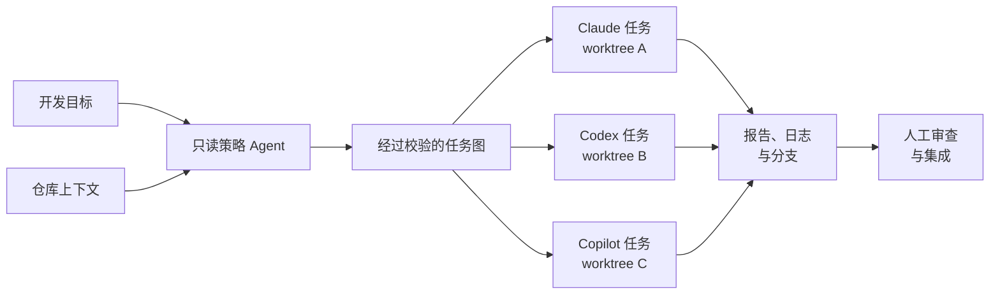

<p align="center">
  
</p>

# Strategos（策略家）

Strategos 是一个本地优先的多 AI 编程代理调度器，面向 Claude Code、
OpenAI Codex CLI 和 GitHub Copilot CLI。

你给出一个目标和任务依赖图，Strategos 会把已经就绪的任务分派给不同
CLI，并为每个任务建立独立 Git worktree。项目上下文、上游任务报告、
日志、分支和变更文件都会留在本机，供你最终审查。

<p align="center">
  
</p>

<p align="center"><em>一个目标 → 校验计划 → 并行 worktree → 人工审查。</em></p>

> 当前为早期 MVP。默认不自动合并，也不自动推送 Agent 生成的分支。

## 解决什么问题

- 用 `AGENTS.md`、项目上下文、团队记忆和上游报告形成共享上下文。
- 由一个只读 strategist CLI 生成任务依赖图，再由 Strategos 校验并展示。
- 默认使用 `hybrid` 参与模式：strategist 完成规划后也会进入健康 Worker 池；
  需要严格角色隔离时仍可配置为 `separated`。
- 默认使用 `auto` 执行模式：生成计划后自动展示 preview 并立即运行；输入
  `/mode manual` 可恢复人工确认。
- 无依赖任务并行执行，数量由 `maxParallel` 限制。
- 每个任务一个 worktree 和分支，避免三个 Agent 同时覆盖文件。
- Claude、Codex、Copilot 使用本机已经登录的 CLI，不额外代理账号和密钥。
- 所有运行证据保存在 `.strategos/runs/<run-id>/`。

## 工作流程



已就绪的任务会并行执行，有依赖的任务则等待上游报告。每个 worker 都留在
独立分支和 worktree 中，最终由你决定集成哪些结果。

## 快速开始

需要 Node.js 24+、Git，以及至少一个支持的 Agent CLI。使用 `fnm` 时，
在仓库中运行 `fnm use` 即可切换到项目指定的大版本。

### 已验证的 CLI 兼容基线

| CLI | 已验证版本 |
| --- | ---: |
| Claude Code | `2.1.215` |
| OpenAI Codex CLI | `0.144.6` |
| GitHub Copilot CLI | `1.0.71` |

以上版本是当前实际验证基线，并非强制锁定版本。兼容和升级策略详见
[COMPATIBILITY.md](COMPATIBILITY.md)（英文标准文档）。

### 启动交互式指令台

推荐直接在 Git 仓库中启动 Strategos，然后输入开发目标：

```bash
cd /你的/项目目录
strategos
```

```text
STRATEGOS v0.7.1
Multi-agent strategy console · codex plans
~/你的/项目目录

Agents   ● claude  ·  ● codex  ·  ● copilot
Runtime  Node v24.18.0 · Git 2.55.0

What are we building?
Describe a goal. Strategos previews the plan, then runs it automatically.

────────────────────────────────────────────────────────
/help commands  ·  /mode auto  ·  preview → run
❯ 为订单列表增加 CSV 导出并补齐测试

Planning  codex is reading the repository in read-only mode...
Plan ready  proposed by codex
Flow  1 implementation  →  2 review
Auto mode  Previewing before execution...
Preview  Max parallel: 3
Executing  Starting the current plan...
```

输入普通文本后，Strategos 会立即以只读模式调用配置的 strategist CLI，让它
检查仓库并返回 JSON 任务图。默认 `hybrid` 模式会在规划结束后把 strategist
也加入健康 Worker 池，因此 Claude、Codex、Copilot 都可以接收执行任务。
Strategos 自身不接入模型 SDK、模型 API 或额外密钥。默认 `auto` 执行模式会
校验并展示 preview，随后立即创建 worker worktree 并运行任务。如果希望先人工
检查，可在输入目标前执行 `/mode manual`，之后再用 `/run` 批准执行。规划过程中
第一次按 `Ctrl+C` 只会提示中断风险，三秒内再次按下才会取消 strategist 调用；
空闲时按 `Ctrl+C` 会退出指令台。常用命令：

```text
/new [目标]   /mode [auto|manual]  /strategist [agent]  /plan
/load <文件>
/save [文件]  /preview               /run        /status [ID]
/agents       /context               /init       /help       /exit
```

完整流程和当前边界详见
[docs/interactive-console.md](docs/interactive-console.md)（英文标准文档）。

交互式终端会显示上述紧凑彩色界面；重定向输出和 CI 不会包含 ANSI 控制字符。
可设置 `NO_COLOR=1` 关闭颜色，使用 `/agents` 查看完整版本和健康详情。

### 使用 `npx` 直接运行

首次体验不需要 clone 或全局安装：

```bash
cd /你的/项目目录
npx --yes github:BigBugaboo/strategos
```

需要自动化时仍可使用非交互命令：

```bash
npx --yes github:BigBugaboo/strategos init
npx --yes github:BigBugaboo/strategos doctor
npx --yes github:BigBugaboo/strategos run .strategos/example-plan.json --dry-run
```

在 Strategos 正式发布到 npm 之前，`npx` 会从 GitHub 默认分支获取代码，
后续运行会复用 npm 缓存。

### 从 GitHub 持久安装

无需手动 clone，即可安装可复用的 `strategos` 命令：

```bash
npm install --global github:BigBugaboo/strategos
strategos --help
```

npm 全局包属于当前启用的 Node.js 环境。使用 `fnm`、Vite+、`nvm` 等
版本管理器时，需要在以后运行 Strategos 的同一套终端环境中完成安装。

### 从源码目录安装

```bash
git clone https://github.com/BigBugaboo/strategos.git
cd strategos
fnm use --install-if-missing # 已经启用 Node.js 24 时可省略
npm ci
npm run verify
npm link
strategos --help
```

参与项目开发时推荐这种链接模式，源码变化会直接反映到全局命令，无需反复安装。

### 初始化目标仓库

```bash
cd /你的/项目目录
strategos init
strategos doctor
```

`strategos init` 会创建配置、共享上下文、团队记忆、示例 Plan 和
`AGENTS.md`，但不会覆盖已有文件。编辑这些文件并提交后再正式执行。

### 预览并执行 Plan

```bash
strategos run .strategos/example-plan.json --dry-run
strategos run .strategos/example-plan.json --max-parallel 3
strategos status
```

真实执行前要求仓库没有未提交变更，因为新 worktree 来自已提交的 `HEAD`。

### 排查 `command not found`

```bash
node --version
npm prefix -g
npm install -g /Strategos/仓库的绝对路径
rehash # 仅 zsh 需要
command -v strategos
strategos --help
```

参与 Strategos 本身的开发时，切换 Node.js 安装后需要重新执行 `npm link`。

### 升级 Strategos

先检查当前安装方式，不执行任何修改：

```bash
strategos upgrade --dry-run
```

确认后升级 npm 全局安装：

```bash
strategos upgrade
strategos --version
strategos doctor
```

`strategos update` 是等价别名。源码目录、`npm link`、临时 `npx` 包和项目
本地依赖不会被自动覆盖，命令会针对识别出的安装方式打印安全升级步骤。
恢复、版本固定和 Agent CLI 升级流程详见
[docs/upgrading.md](docs/upgrading.md)（英文标准文档）。

## 建议分工

- Claude：主功能实现、大范围理解和重构。
- Codex：测试、边界条件、独立实现或代码复核。
- Copilot：GitHub 相关审查、文档和最终检查。

具体职责写在 Plan 中，不由 Strategos 硬编码。

## 安全边界

- Codex 默认使用 `read-only` 或 `workspace-write` 沙箱。
- Claude 只使用 `plan` 或 `auto` 权限模式。
- Copilot 写权限需要使用者在配置中显式增加当前版本支持的参数。
- 默认不使用任何 dangerous bypass 参数。
- 默认不 merge、不 push、不删除 worktree。
- worktree 解决的是代码冲突，不等于完整操作系统沙箱。

完整英文说明、Plan 示例、架构和灵感来源见 [README.md](README.md)。

## License

MIT
